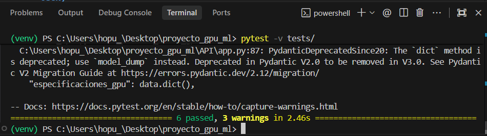
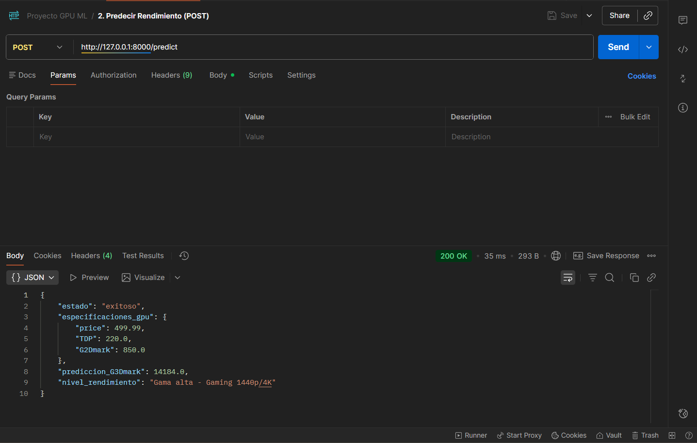

# Documentación Técnica del Proyecto GPU ML

## 1. Descripción Técnica

### 1.1. Definición del Problema
El mercado de tarjetas gráficas (GPUs) presenta una alta volatilidad de precios y una gran complejidad técnica. Los consumidores a menudo carecen de herramientas objetivas para estimar el rendimiento real de una tarjeta basándose únicamente en sus especificaciones comerciales (precio, consumo, etc.), lo que dificulta la toma de decisiones de compra informadas.

### 1.2. Solución Propuesta
Se ha desarrollado un sistema inteligente compuesto por:
1.  **Modelo de Machine Learning:** Capaz de predecir el puntaje de benchmark `G3Dmark` (rendimiento 3D) a partir de variables clave.
2.  **API REST:** Una interfaz programable que expone el modelo para su consumo.
3.  **Dashboard Interactivo:** Una interfaz web amigable para que el usuario final interactúe con el sistema.

---

## 2. Análisis Exploratorio de Datos (EDA)

Se utilizó un dataset de GPUs con las siguientes características principales:
*   **Variables de Entrada (Features):** `price` (USD), `TDP` (Watts), `G2Dmark`.
*   **Variable Objetivo (Target):** `G3Dmark`.

### Hallazgos Principales:
*   **Correlación Precio-Rendimiento:** Se observó una correlación positiva fuerte entre el precio y el puntaje G3Dmark, aunque con rendimientos decrecientes en la gama ultra alta.
*   **Impacto del TDP:** El consumo energético (TDP) demostró ser un predictor fiable de la potencia bruta de la tarjeta.

**(Gráfico de dispersión Precio vs G3Dmark)**

---

## 3. Preprocesamiento de Datos

Para garantizar la calidad del entrenamiento, se aplicaron las siguientes transformaciones:

1.  **Limpieza:** Eliminación de registros con valores nulos en columnas críticas.
2.  **Feature Engineering:** Creación de la variable `price_per_watt` (`price` / `TDP`) para capturar la eficiencia de costo de cada tarjeta.
3.  **Selección de Features:** Se descartaron variables irrelevantes (como `category` o `manufacturer`) para evitar ruido y sesgos de marca.

---

## 4. Entrenamiento y Análisis del Modelo

### 4.1. Selección del Algoritmo
Se seleccionó **Random Forest Regressor** por las siguientes razones:
*   Capacidad para modelar relaciones no lineales.
*   Robustez frente a outliers.
*   No requiere escalado de características (a diferencia de redes neuronales o SVM).

### 4.2. Métricas de Desempeño
El modelo fue evaluado utilizando un conjunto de prueba (20% de los datos):

*   **R2 Score:** ~0.93 (El modelo explica el 93% de la varianza en el rendimiento).
*   **MAE (Mean Absolute Error):** ~1200 puntos (Error promedio absoluto en la predicción).

**(Gráfico de Predicción vs Realidad o Importancia de Variables)**

---

## 5. Evidencias de Pruebas

### 5.1. Pruebas Unitarias (Pytest)
Se ejecutaron pruebas automatizadas para validar la lógica interna:
*   `test_model.py`: Verifica la estructura de datos y la capacidad de entrenamiento.
*   `test_api.py`: Verifica los códigos de respuesta HTTP (200, 422).

**(Captura de terminal ejecutando pytest con resultados en verde)**

### 5.2. Pruebas de Integración (Postman)
Se validaron los endpoints de la API manualmente.

**(Captura de Postman con la petición POST y la respuesta JSON)**

---

## 6. Interfaz de Usuario (Capturas)

### 6.1. API (Swagger UI)
La documentación automática generada por FastAPI.

**(Captura de http://localhost:8000/docs)**

### 6.2. Dashboard (Streamlit)
La interfaz final donde el usuario realiza las predicciones.

**(Captura del Dashboard con una predicción realizada)**
*
